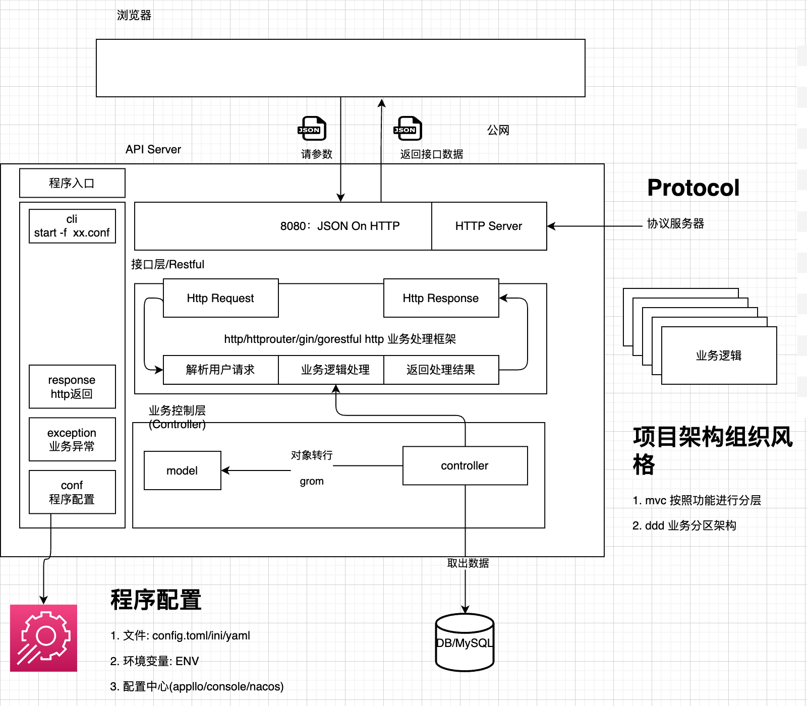
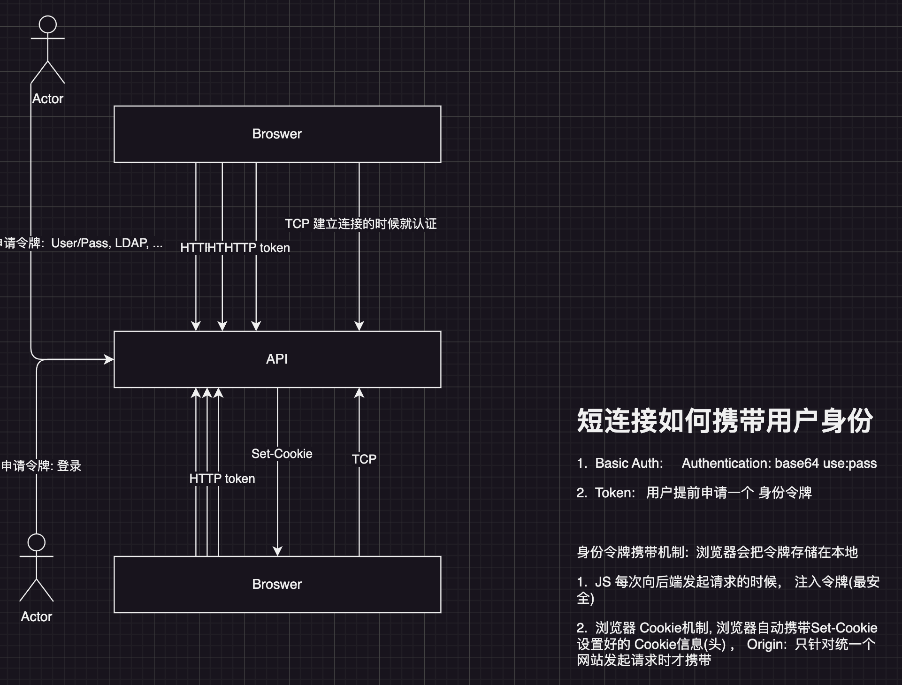
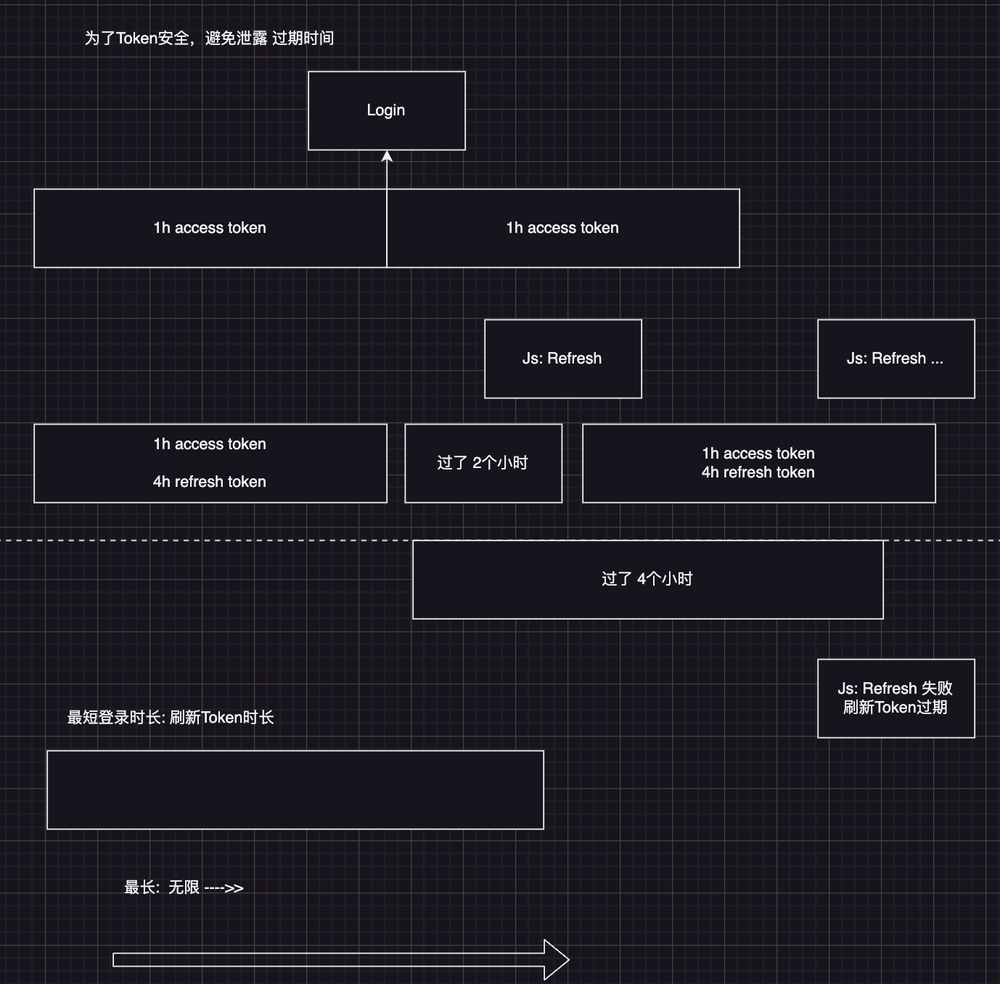
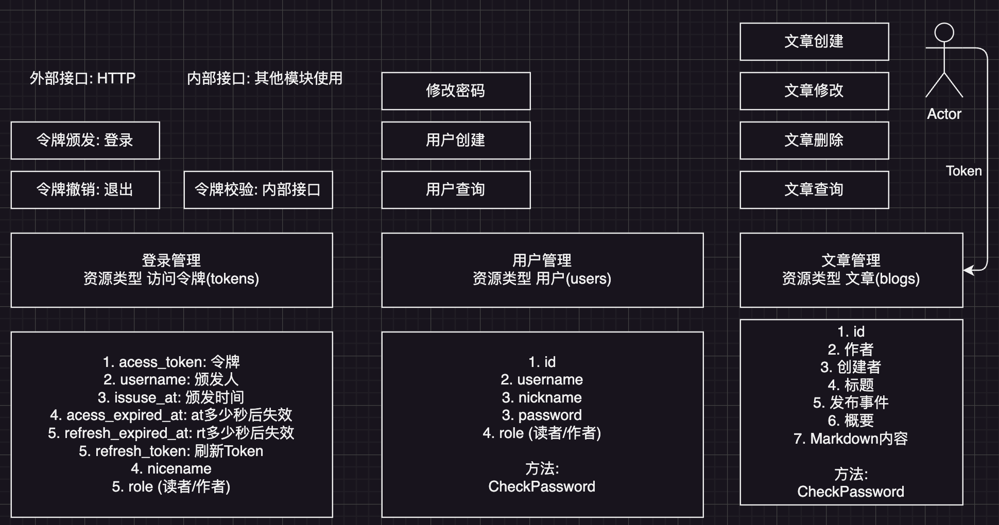
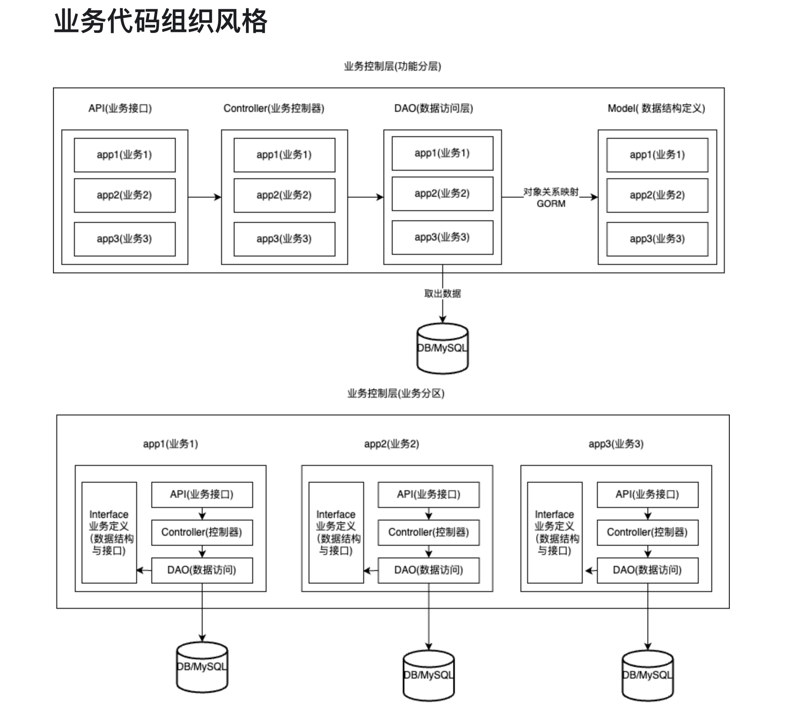

# Web 全栈开发

Vblog 项目介绍与骨架搭建:

- 项目概要设计: 需求,流程,原型与架构
- 项目详细设计: API 接口设计,数据库表结构设计
- 业务代码组织流程设计(面向对象的程序设计)
- 项目架构风格: 功能分区与业务分区架构(面向业务 DDD 简化架构)

详细说明:

- 项目课整体介绍
- 软件开发生命周期流程介绍
- 项目需求概述: Markdown 博客管理系统
- 项目原型草图: 访客前提与博客管理后台
- 项目技术栈与架构: Gin+GROM+Vue3+ArcoDesign
- 项目 RESTful 风格 API 设计
- 项目中的单元测试与 Vscode 单元测试配置
- Vscode 中如何对 Go 项目进行单步调试
- 如何编写功能分区架构风格的代码(MVC)
- 如果编写业务分区架构风格的代码(模块化)

## 项目需求概述: 博客发布，读者阅读

Markdown 文档管理需求:

- 笔记管理: Markdonw 笔记
- GitBook: 书籍组织
- 内部知识库: 某个专题的文章收录

我们只做 Mardonw 博客网站:

- 博客作者,内容生产
- 博客读者, 阅读内容

## 项目原型草图: 访客前台与博客管理后台

参考的产品: [我的博客](https://yumaojun03.github.io/)

1. 访客前台页面:

- 
- 内容详情 直接通过 UI 展示 Markdown 内容

2. 博客管理后台

- 
- 
- 

## 项目技术栈与架构



前端:

- [Vue3(HTML/CSS/JS)](http://vue.org/)
- [ArcoDesign](https://arco.design/vue/component/auto-complete)

后端:

- Gin
- GROM

## 认证的方案

- Basic Auth
- Base Token

令牌颁发方案:



令牌刷新方案:



## 功能设计



## RESTful 接口设计

API: 程序编程接口

- 资源(用户的数据), 作者编写的博客, 业务功能对应的数据
- 资源动作: 创建文章,编写文章,....

接口风格:

- SOAP: HTTP(POST)/XML, post /url/password/change body
- RESTFUL: HTTP(HTTP method)/JSON

什么是 RESTful 风格 API? 需要合理的对资源进行设计(拆解成子资源)

HTTP method:

- get
- post
- put
- patch
- delete
- options
- ...

REST: (resource) representational state transfer: (资源)状态转化, 用户的操作的资源的状态进行了变更, URL 命名: 以资源进行结尾 xxxxx/users, xxxx/blogs, xxxx/books

- get: 获取一类资源, xxx/books, filter: url query string
- get: 获取单个资源, xxxx/books/{id}
- post: 创建资源, xxxx/books, http body
- put/patch: 修改一个资源, put: 全量修改, patch 增量修改, xxxx/books/{id}, http body
- delete: 删除一个资源，xxxx/books/{id}

### 登录接口

定义 Token 对象

```go
type Token struct {
	// 该Token是颁发
	UserId string `json:"user_id" gorm:"column:user_id"`
	// 人的名称， user_name
	UserName string `json:"username" gorm:"column:username"`
	// 办法给用户的访问令牌(用户需要携带Token来访问接口)
	AccessToken string `json:"access_token" gorm:"column:access_token"`
	// 过期时间(2h), 单位是秒
	AccessTokenExpiredAt int `json:"access_token_expired_at" gorm:"column:access_token_expired_at"`
	// 刷新Token
	RefreshToken string `json:"refresh_token" gorm:"column:refresh_token"`
	// 刷新Token过期时间(7d)
	RefreshTokenExpiredAt int `json:"refresh_token_expired_at" gorm:"column:refresh_token_expired_at"`

	// 创建时间
	CreatedAt int64 `json:"created_at" gorm:"column:created_at"`
	// 更新实现
	UpdatedAt int64 `json:"updated_at" gorm:"column:updated_at"`

	// 额外补充信息, gorm忽略处理
	Role string `json:"role" gorm:"-"`
}
```

- Login: POST /vblog/api/v1/tokens Boby:

请求: 令牌颁发请求

```json
{
  "username": "admin",
  "password": "123456",
  "is_member": true
}
```

响应: Token 对象

```json
{
  "user_id": "admin",
  "username": "",
  "access_token": "",
  "access_token_expired_at": 0,
  "refresh_token": "",
  "refresh_token_expired_at": 0,
  "created_at": 0,
  "updated_at": 0,
  "role": "admin"
}
```

- Logout: DELETE /vblog/api/v1/tokens HEADER cookie

```http
Custom-Header: access_token
```

响应: Token 对象

```json
{
  "user_id": "admin",
  "username": "",
  "access_token": "",
  "access_token_expired_at": 0,
  "refresh_token": "",
  "refresh_token_expired_at": 0,
  "created_at": 0,
  "updated_at": 0,
  "role": "admin"
}
```

### 博客管理接口

- Meta 数据: 每一个对象必须要有的属性, 并且不是用户输入的, 系统添加

```go
type Meta struct {
	// 用户Id
	Id int `json:"id" gorm:"column:id"`
	// 创建时间, 时间戳 10位, 秒
	CreatedAt int64 `json:"created_at" gorm:"column:created_at"`
	// 更新时间, 时间戳 10位, 秒
	UpdatedAt int64 `json:"updated_at" gorm:"column:updated_at"`
}
```

- 用户参数

```go
type CreateBlogRequest struct {
	// 文章标题
	Title string `json:"title" gorm:"column:title" validate:"required"`
	// 作者
	Author string `json:"author" gorm:"column:author" validate:"required"`
	// 文章内容
	Content string `json:"content" gorm:"column:content" validate:"required"`
	// 文章概要信息
	Summary string `json:"summary" gorm:"column:summary"`
	// 创建人
	CreateBy string `json:"create_by" gorm:"column:create_by"`
	// 标签 https://gorm.io/docs/serializer.html
	Tags map[string]string `json:"tags" gorm:"column:tags;serializer:json"`
}
```

- 状态管理: 只有你的博客发布了，才能被看到

```go
// 发布才能修改文章状态
// `published_at` int NOT NULL COMMENT '发布时间',
// `status` tinyint NOT NULL COMMENT '文章状态: 草稿/已发布',
type ChangedBlogStatusRequest struct {
	// 发布时间
	PublishedAt int64 `json:"published_at" gorm:"column:published_at"`
	// 文章状态: 草稿/已发布
	Status Status `json:"status" gorm:"column:status"`
}
```

整个对象:

```go
// 构造函数, 对对象进行初始化, 统一对对象的初始者进行管理,
// 保证构造的对象 是可用的, 不容易出现nil
func NewBlog() *Blog {
	return &Blog{
		&Meta{
			CreatedAt: time.Now().Unix(),
		},
		&CreateBlogRequest{
			Tags: map[string]string{},
		},
		&ChangedBlogStatusRequest{},
	}
}

type Blog struct {
	*Meta
	*CreateBlogRequest
	*ChangedBlogStatusRequest
}
```

- 博客创建接口 CreateBlog: POST /vblog/api/v1/blogs

```json
{
  "title": "",
  "author": "",
  "content": "",
  "summary": "",
  "create_by": "",
  "tags": {}
}
```

```json
{
  "id": 0,
  "created_at": 1716023977,
  "updated_at": 0,
  "title": "",
  "author": "",
  "content": "",
  "summary": "",
  "create_by": "",
  "tags": {},
  "published_at": 0,
  "status": 0
}
```

- 博客列表接口 Blog: GET /vblog/api/v1/blogs?page_size=10&page_number=1&....
```json
[{}, {}]
```

- 博客详情接口 Blog: GET /vblog/api/v1/blogs/{id}
```json
{}
```

- 博客全量修改接口 Blog: PUT /vblog/api/v1/blogs/{id}
```json
{
  "title": "",
  "author": "",
  "content": "",
  "summary": "",
  "create_by": "",
  "tags": {}
}
```
```json
{}
```

- 博客增量修改接口 Blog: PATCH /vblog/api/v1/blogs/{id}
```json
{
  "title": "",
  "author": "",
  "content": "",
  "summary": "",
  "create_by": "",
  "tags": {}
}
```
```json
{}
```

- 博客删除修改接口 Blog: DELETE /vblog/api/v1/blogs/{id}
```json
{}
```


## 业务架构

代码编写方式: 设计和实现分离
+ 顶层设计: 自上而下
+ 具体实现: 自下而上



[关于业务架构](https://www.mcube.top/docs/framework/core/arch/)


## 重点

+ 项目课规则和项目仓库与作业
+ 业务逻辑: 认证的方案(双Token的方案设计)
+ 单元测试和Debug
+ RESTful接口
+ 面向对象: 组合, 构造函数


```sh
curl 'http://127.0.0.1:8080/vblog/api/v1/blogs/' \
  -X 'OPTIONS' \
  -H 'Accept-Language: en,zh-CN;q=0.9,zh;q=0.8' \
  -H 'Access-Control-Request-Method: GET' \
  -H 'Access-Control-Request-Private-Network: true' \
  -H 'Cache-Control: no-cache' \
  -H 'Connection: keep-alive' \
  -H 'Origin: https://gitee.com' \
  -H 'Pragma: no-cache' \
  -H 'Referer: https://gitee.com/infraboard/go-course/blob/master/day19/browser.md' \
  -H 'Sec-Fetch-Dest: empty' \
  -H 'Sec-Fetch-Mode: cors' \
  -H 'Sec-Fetch-Site: cross-site' \
  -H 'User-Agent: Mozilla/5.0 (Macintosh; Intel Mac OS X 10_15_7) AppleWebKit/537.36 (KHTML, like Gecko) Chrome/126.0.0.0 Safari/537.36'
```
