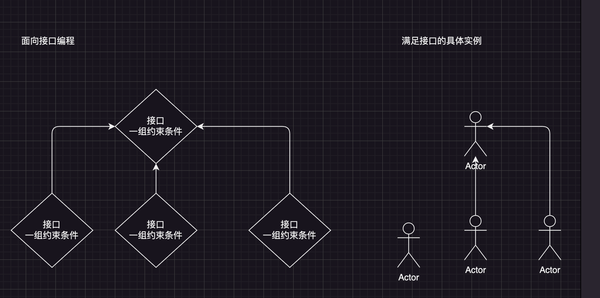
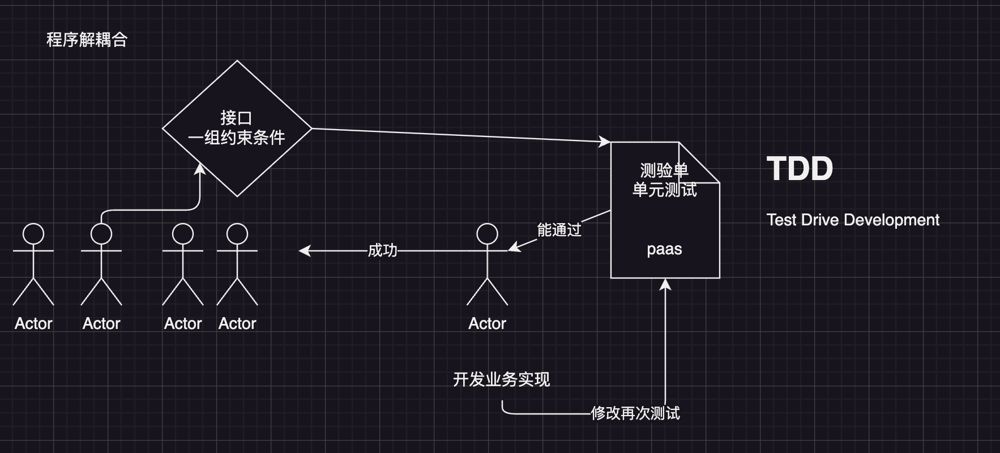
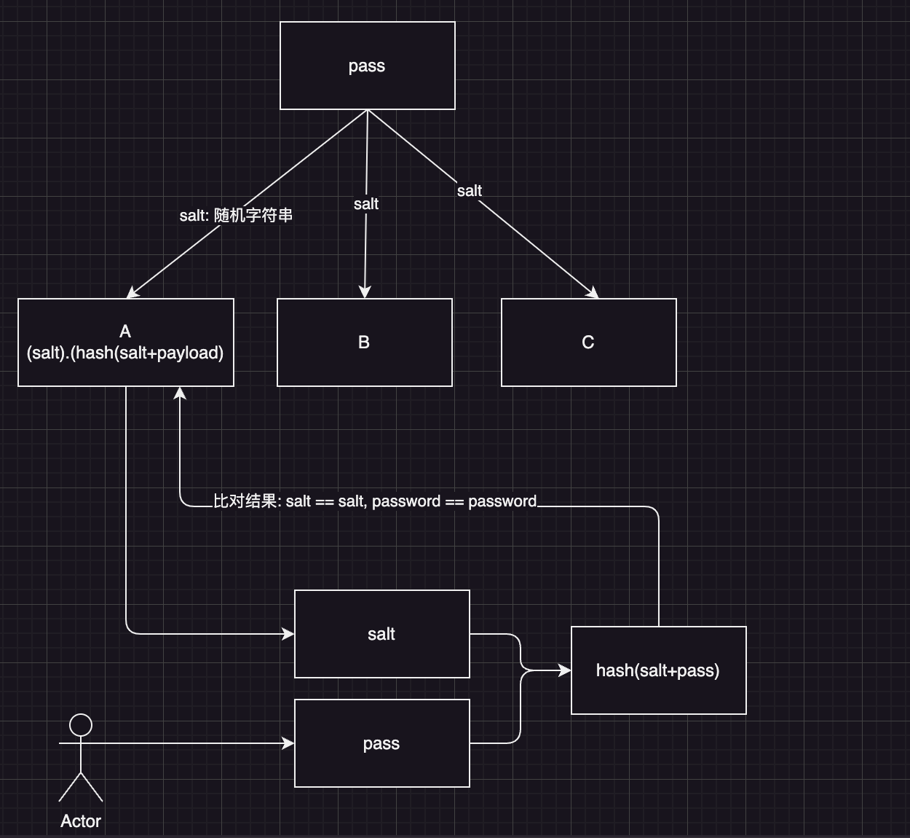

# 用户模块


## 接口定义(业务定义)

1. 定义User对象结构
```go
// 用户创建成功后返回一个User对象
// CreatedAt 为啥没用time.Time, int64(TimeStamp), 统一标准化, 避免时区你的程序产生影响
// 在需要对时间进行展示的时候，由前端根据具体展示那个时区的时间
type User struct {
	*common.Meta

	// 用户参数
	*CreateUserRequest
}
```

2. 定义接口

```go
// user.Service
// 用户管理接口
// 接口定义的原则:  站在调用方(使用者)的角度来设计接口
// userServiceImpl.CreateUser(ctx, *CreateUserRequest)
// 站在接口的调用方, triaceId, 其他非业务参数 他不理解
type Service interface {
	// 用户创建
	// 1. 用户取消了请求怎么办?
	// 2. 后面要做Trace, Trace ID怎么传递进来
	// 3. 多个接口 需要做事务(Session), 这个事务对象怎么传递进来
	// 4. CreateUser(username, password string)
	//    CreateUser(username, password string, labels map[string]string)
	// 能不能放到 Request里面定义
	CreateUser(context.Context, *CreateUserRequest) (*User, error)
	// 用户查询
	// 总统有多个
	QueryUser(context.Context, *QueryUserRequest) (*UserSet, error)
}
```

## 接口的具体实现

面向接口编程:



采用TDD来驱动业务实现:




单元测试先行:
```go
type UserServiceImpl struct {
}

func (i *UserServiceImpl) CreateUser(
	ctx context.Context,
	in *user.CreateUserRequest) (
	*user.User, error) {
	return nil, nil
}

func (i *UserServiceImpl) QueryUser(
	ctx context.Context,
	in *user.QueryUserRequest) (
	*user.UserSet, error) {
	return nil, nil
}
```

加载依赖
```go
func NewUserServiceImpl() *UserServiceImpl {
	// 每个业务对象, 都可能依赖到 数据库
	// db = create conn
	// 获取一个全新的 mysql 连接池对象
	// 程序启动的时候一定要加载配置
	return &UserServiceImpl{
		db: conf.C().MySQL.GetDB(),
	}
}
```

### 准备MySQL

准备好一个MySQL
```sh
docker run --name mysql -p 3306:3306 -e MYSQL_ROOT_PASSWORD=123456 -d mysql:8.0 --character-set-server=utf8mb4 --collation-server=utf8mb4_unicode_ci
```

vsCode 免费插件: 连接至服务

准备表: docs/table/table.sql
```sql
-- Active: 1706265201597@@127.0.0.1@3306@go15
CREATE TABLE `users` (
  `id` int unsigned NOT NULL AUTO_INCREMENT,
  `created_at` int NOT NULL COMMENT '创建时间',
  `updated_at` int NOT NULL COMMENT '更新时间',
  `username` varchar(255) CHARACTER SET utf8mb4 COLLATE utf8mb4_general_ci NOT NULL COMMENT '用户名, 用户名不允许重复的',
  `password` varchar(255) COLLATE utf8mb4_general_ci NOT NULL COMMENT '不能保持用户的明文密码',
  `label` varchar(255) COLLATE utf8mb4_general_ci NOT NULL COMMENT '用户标签',
  `role` tinyint NOT NULL COMMENT '用户的角色',
  PRIMARY KEY (`id`) USING BTREE,
  UNIQUE KEY `idx_user` (`username`)
) ENGINE=InnoDB AUTO_INCREMENT=1 DEFAULT CHARSET=utf8mb4 COLLATE=utf8mb4_general_ci;

CREATE TABLE `tokens` (
  `created_at` int NOT NULL COMMENT '创建时间',
  `updated_at` int NOT NULL COMMENT '更新时间',
  `user_id` int NOT NULL COMMENT '用户的Id',
  `username` varchar(255) CHARACTER SET utf8mb4 COLLATE utf8mb4_general_ci NOT NULL COMMENT '用户名, 用户名不允许重复的',
  `access_token` varchar(255) CHARACTER SET utf8mb4 COLLATE utf8mb4_general_ci NOT NULL COMMENT '用户的访问令牌',
  `access_token_expired_at` int NOT NULL COMMENT '令牌过期时间',
  `refresh_token` varchar(255) COLLATE utf8mb4_general_ci NOT NULL COMMENT '刷新令牌',
  `refresh_token_expired_at` int NOT NULL COMMENT '刷新令牌过期时间',
  PRIMARY KEY (`access_token`) USING BTREE,
  UNIQUE KEY `idx_token` (`access_token`) USING BTREE
) ENGINE=InnoDB DEFAULT CHARSET=utf8mb4 COLLATE=utf8mb4_general_ci;

CREATE TABLE `blogs` (
  `id` int unsigned NOT NULL AUTO_INCREMENT COMMENT '文章的Id',
  `tags` text CHARACTER SET utf8mb4 COLLATE utf8mb4_general_ci NOT NULL COMMENT '标签',
  `created_at` int NOT NULL COMMENT '创建时间',
  `published_at` int NOT NULL COMMENT '发布时间',
  `updated_at` int NOT NULL COMMENT '更新时间',
  `title` varchar(255) CHARACTER SET utf8mb4 COLLATE utf8mb4_general_ci NOT NULL COMMENT '文章标题',
  `author` varchar(255) CHARACTER SET utf8mb4 COLLATE utf8mb4_general_ci NOT NULL COMMENT '作者',
  `content` text CHARACTER SET utf8mb4 COLLATE utf8mb4_general_ci NOT NULL COMMENT '文章内容',
  `status` tinyint NOT NULL COMMENT '文章状态',
  `summary` varchar(255) CHARACTER SET utf8mb4 COLLATE utf8mb4_general_ci NOT NULL COMMENT '文章概要信息',
  `create_by` varchar(255) COLLATE utf8mb4_general_ci NOT NULL COMMENT '创建人',
  `audit_at` int NOT NULL COMMENT '审核时间',
  `is_audit_pass` tinyint NOT NULL COMMENT '是否审核通过',
  PRIMARY KEY (`id`),
  UNIQUE KEY `idx_title` (`title`) COMMENT 'titile添加唯一键约束'
) ENGINE=InnoDB AUTO_INCREMENT=1 DEFAULT CHARSET=utf8mb4 COLLATE=utf8mb4_general_ci;
```

### Create User

```go
func (i *UserServiceImpl) CreateUser(ctx context.Context, in *user.CreateUserRequest) (*user.User, error) {
	// 1. 校验请求的合法性
	if err := common.Validate(in); err != nil {
		return nil, err
	}

	// 2. 创建user对象(资源)
	ins := user.NewUser(in)

	// 3. user 对象保持入库
	/*
	  读取数据库配置
	  获取数据库连接
	  操作连接 保证数据
	*/
	// INSERT INTO `users` (`created_at`,`updated_at`,`username`,`password`,`role`,`label`) VALUES (1716623778,1716623778,'admin','123456',0,'{}')
	if err := i.db.Save(ins).Error; err != nil {
		return nil, err
	}

	// 4. 返回保持后的user对象
	return ins, nil
}
```

### Password 存储问题

密码应该怎么保存:
+ 对称加密: AES,  a ---> b, 加密数据
+ 非对称加密: RSA, 加密密钥
+ 散列算法: MD5, SHA1, SHA256, ..., 消息摘要， () ---> xxxxx

怎么比对密码: (123456) --hash->  xxxxx
        数据库:                 (password hash)


通常的散例是固定: (xxx) --> (yyyy), 有没有办法让 同一密码 Hash的值每次都不一样


加盐Hash比对流程:



bcrypt: 加盐Hash, 强度因子可调 [散列算法](https://gitee.com/infraboard/go-course/blob/master/day09/go-hash.md)

```go
// $2a$14$pME0GgcoFvgTOyC7sL81VeKOwZ6O1M1gAvSXQEbs.rfC5JoQafsaW
// $2a$14$Pi0m.tNlF8Cd7LGKI.Hpb.OXAk0J1o7KNW7eOq3RBc4gwBOnFjwEa
// $2a$14$ZarejWmFibFhNHkvVxitrOyNsRwTpeQsCFQuiOSx3SL4yHjFf5yAa
func TestPasswordHash(t *testing.T) {
	password := "secret"
	hash, _ := HashPassword(password) // ignore error for the sake of simplicity

	fmt.Println("Password:", password)
	fmt.Println("Hash:    ", hash)

	match := CheckPasswordHash(password, hash)
	fmt.Println("Match:   ", match)
}

func HashPassword(password string) (string, error) {
	bytes, err := bcrypt.GenerateFromPassword([]byte(password), 14)
	return string(bytes), err
}

func CheckPasswordHash(password, hash string) bool {
	err := bcrypt.CompareHashAndPassword([]byte(hash), []byte(password))
	return err == nil
}
```

密码入库前进行Hash
```go
func (req *CreateUserRequest) HashPassword() error {
	cryptoPass, err := bcrypt.GenerateFromPassword([]byte(req.Password), bcrypt.DefaultCost)
	if err != nil {
		return err
	}
	req.Password = string(cryptoPass)
	return nil
}
```

验证PasswordHash比对逻辑是否正确:
```go
func TestUserCheckPassword(t *testing.T) {
	req := user.NewCreateUserRequest()
	req.Username = "admin"
	req.Password = "123456"
	u := user.NewUser(req)

	u.HashPassword()
	t.Log(u.CheckPassword("1234561"))
}
```

### 查询用户

```go
// 怎么查询用户: 根据过来条件 去数据库里面 过滤出具体的资源
// WhERE 以及 LIMITE
func (i *UserServiceImpl) QueryUser(
	ctx context.Context,
	in *user.QueryUserRequest) (
	*user.UserSet, error) {

	set := user.NewUserSet()

	// 构造一个查询语句, TableName() select
	// WithContext
	query := i.db.Model(&user.User{}).WithContext(ctx)

	// Where where username = ?
	// SELECT * FROM `users` WHERE username = 'admin' LIMIT 10
	if in.Username != "" {
		// 注意: 返回一个新的对象, 并没有直接修改对象
		// 新生产的query 语句才有 query
		query = query.Where("username = ?", in.Username)
	}
	// ...

	// 怎么查询Total, 需要把过滤条件: username ,key
	// 查询Total时能不能把分页参数带上
	// select COUNT(*) from xxx limit 10
	// select COUNT(*) from xxx
	// 不能携带分页参数
	if err := query.Count(&set.Total).Error; err != nil {
		return nil, err
	}

	// LIMIT ?,?
	// SELECT * FROM `users` LIMIT 10
	if err := query.
		Offset(in.Offset()).
		Limit(in.PageSize).
		Find(&set.Items).Error; err != nil {
		return nil, err
	}

	return set, nil
}
```