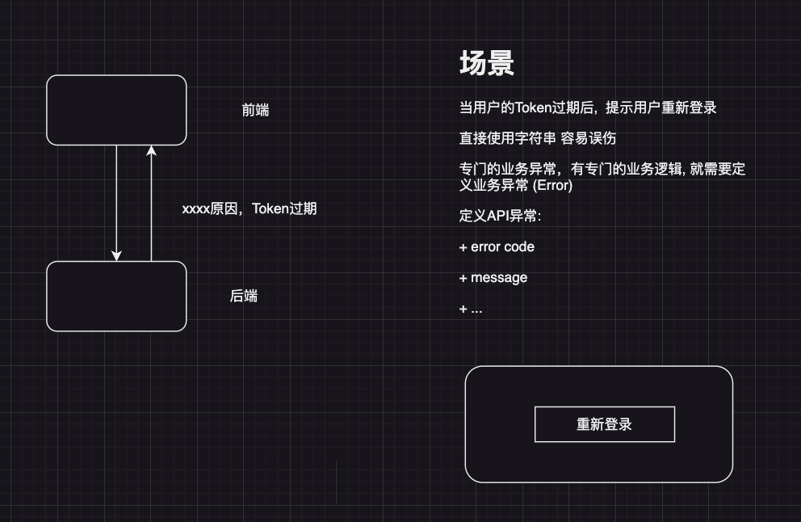

# API 异常定义(自定义API异常)

+ 用户名或者密码不正确
+ 用户不存在
+ Token过期

这些场景 为什么需要有定义业务异常




## 现状

```go
return fmt.Errorf("用户名或者密码不正确")
```

只有一个message: 用户名或者密码不正确, 不包含业务码, 也无法扩展


## 定义的业务异常

```go
// 用于描述业务异常
type ApiExcepiton struct {
	// 业务异常的编码, 50001 表示Token过期
	Code int `json:"code"`
	// 异常描述信息
	Message string `json:"message"`
}
```

```go
IssueToken(context.Context, *IssueTokenRequest) (*Token, error)
```

我们需要扩展error
```go
// The error built-in interface type is the conventional interface for
// representing an error condition, with the nil value representing no error.
type error interface {
	Error() string
}
```


## 使用

```go
func TestException(t *testing.T) {
	err := CheckIsError()
	// error打印的是ApiExcepiton对象吗？
	// 还是和标准的Error打印的内容一样？
	// 用户名或者密码不正确:
	// 打印的是ApiExcepiton , 由于这个对象实现Error方法, Error方法返回的结果
	t.Log(err)

	// 怎么获取ErrorCode, 断言这个接口的对象的具体类型
	if v, ok := err.(*exception.ApiExcepiton); ok {
		t.Log(v.Code)
		t.Log(v.String())
	}

	// 前端想要获取的是一个完整ApiExcepiton, 该怎么获取
	dj, _ := json.MarshalIndent(err, "", "  ")
	t.Log(string(dj))
}
```

```go
import "gitlab.com/go-course-project/go15/vblog/exception"

var (
	ErrAuthFailed = exception.NewApiExcepiton(50001, "用户名或者密码不正确")
)
```