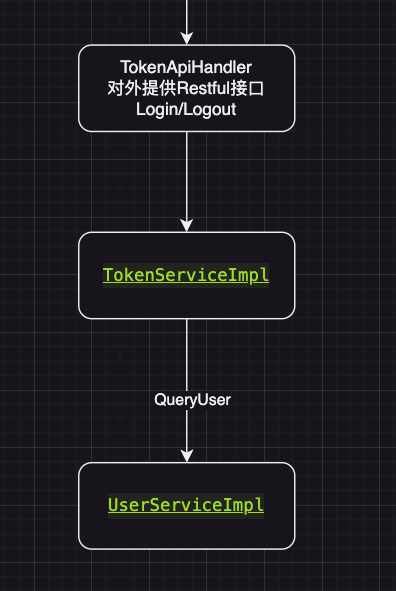
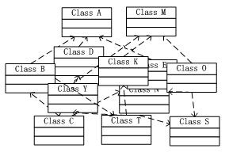
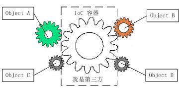

# IOC(依赖倒置): 对象依赖管理

## 现在

```go
// 把程序需要对象组织起来，组装成业务程序 来处理业务逻辑
// User BO
userServiceImpl := user.NewUserServiceImpl()
// Token BO
tokenServiceImpl := token.NewTokenServiceImpl(userServiceImpl)

// token 模块子路有
tokenApiHandler := api.NewTokenApiHandler(tokenServiceImpl)
```



在程序启动的时候(main), 收到传递依赖, main组装流程异常复杂, 如果有2个模块(20 serviceImpl, 20API对象), main逻辑很复杂



## IOC

让软件工程规模化, 很好的模块化管理

为了解决对象之间的耦合度过高的问题，软件专家Michael Mattson 1996年提出了IOC理论，用来实现对象之间的“解耦”，目前这个理论已经被成功地应用到实践当中

IOC理论提出的观点大体是这样的：借助于“第三方”实现具有依赖关系的对象之间的解耦:

IOC是Inversion of Control的缩写，多数书籍翻译成“控制反转”, 使用逻辑或者角色发送了变化



+ 被动模式: main,  Developer ---->  Class:   Developer 复杂依赖的管理: 被动模式(class), 被动等待Developer在main组装时传递依赖
+ 主动模式: ioc 就是一种主动模式, class 不在被动等待依赖的传递过来, 而是, 自己主动到ioc容器里面去获取依赖, Class() ----> (Ioc 获取依赖), 下面这张方式又模块开发来自己获取自己毅力更加灵活，更加集中，容易规模化


### IOC Container

系统内容所有业务对象(BO)的一个托儿所, 这样业务对象的依赖才能自己去问IOC Container要, Map{对象名称: 对象的地址}

有了这个 ioc Container 我们能达到一个什么样的效果
```go
func NewTokenServiceImpl(userServiceImpl user.Service) *TokenServiceImpl {
	// 每个业务对象, 都可能依赖到 数据库
	// db = create conn
	// 获取一个全新的 mysql 连接池对象
	// 程序启动的时候一定要加载配置
	return &TokenServiceImpl{
		db:   conf.C().MySQL.GetDB(),
		user: userServiceImpl,
	}
}

type TokenServiceImpl struct {
	// db conn 共享对象
	// mysql host port  ....
	db *gorm.DB

	// 依赖用户服务
	user user.Service
}
```
 
 参数不需要主动传递, 对象自己主动获取
 ```go
 func NewTokenServiceImpl() *TokenServiceImpl {
	return &TokenServiceImpl{
		db:   conf.C().MySQL.GetDB(),
        // 从Ioc Container中获取, 先获取后断言, 断言获取出来的对象实现了该接口
		user: ioc.GetObject("user").(user.Service),
	}
}

// TokenServiceImpl 时需要给注册到Ioc里面
func init() {
    // 把TokenServiceImpl{} 注册到 ioc里面的 Contoller Ioc Container里面
    // ioc.GetObject("token") 获取注册到ioc 里面的&TokenServiceImpl{}对象
    ioc.Contrller().Registry("token", &TokenServiceImpl{})
}

type TokenServiceImpl struct {
	// db conn 共享对象
	// mysql host port  ....
	db *gorm.DB

	// 依赖用户服务
	user user.Service
}
 ```

注册User模块
  ```go
// TokenServiceImpl 时需要给注册到Ioc里面
func init() {
    // UserServiceImpl{} 注册到 ioc里面的 Contoller Ioc Container里面
    // ioc.GetObject("user") 获取注册到ioc 里面的&UserServiceImpl{}对象
    ioc.Contrller().Registry("user", &UserServiceImpl{})
}

type UserServiceImpl struct {
	// db conn 共享对象
	// mysql host port  ....
	db *gorm.DB
}
 ```


市面上有没有Ioc Container的具体实现:
+ [dig](https://www.bilibili.com/read/cv24867421/)
+ golang-ioc
+ mcube ioc


基本的使用样例:
```go
func TestRegistry(t *testing.T) {
	ioc.Controller.Registry("user", &user.UserServiceImpl{})

	// 0x140000b6708
	t.Logf("%p", ioc.Controller.Get("user"))
}
```

### 使用Map来封装一个Ioc Container

实现对象的:
+ 注册
+ 获取
+ 初始化

```go
// Map类型的IocContainer
type MapContainer struct {
	storge map[string]Object
}

// 注册对象
func (c *MapContainer) Registry(name string, obj Object) {
	c.storge[name] = obj
}

// 获取对象
func (c *MapContainer) Get(name string) any {
	return c.storge[name]
}

// 调用所有被托管对象的Init方法, 对对象进行初始化
func (c *MapContainer) Init() error {
	for k, v := range c.storge {
		if err := v.Init(); err != nil {
			return fmt.Errorf("%s init error, %s", k, err)
		}
		fmt.Printf("%s init successs", k)
	}
	return nil
}
```


### 业务的具体实现Controller 托管到Ioc

1. 托管: UserServiceImpl 到Ioc
```go
// import _ ---> init方法来注册 包里面的核心对象
func init() {
	ioc.Controller.Registry(user.AppName, &UserServiceImpl{})
}
```

2. 托管: TokenServiceImpl 到Ioc
```go
// import _ ---> init方法来注册 包里面的核心对象
func init() {
	ioc.Controller.Registry(token.AppName, &TokenServiceImpl{})
}
```

3. TokenServiceImpl通过Ioc依赖UserServiceImpl对象
```go
func (i *TokenServiceImpl) Init() error {
	// 	return &TokenServiceImpl{
	// 		db:   conf.C().MySQL.GetDB(),
	// 		user: userServiceImpl,
	// 	}
	i.db = conf.C().MySQL.GetDB()
	// 获取对象 Controller.Get(user.AppName)
	// 断言对象实现了user.Service
	i.user = ioc.Controller.Get(user.AppName).(user.Service)
	return nil
}
```

4. Token Api Handler 获取依赖对象
```go
func NewTokenApiHandler() *TokenApiHandler {
	return &TokenApiHandler{
		token: ioc.Controller.Get(token.AppName).(token.Service),
	}
}
```

5. 程序启动的时候注册业务，并初始化Ioc
```go
import (
	//...
	// 业务对象注册
	_ "gitlab.com/go-course-project/go15/vblog/apps/token/impl"
	_ "gitlab.com/go-course-project/go15/vblog/apps/user/impl"
)

func main() {
	//...

	// 2. 初始化Ioc
	if err := ioc.Controller.Init(); err != nil {
		panic(err)
	}
```


6. 之前New的逻辑Ioc已经帮忙完成, 所有依赖通过ioc 获取
```go
// Registry() Init()
// func NewTokenServiceImpl(userServiceImpl user.Service) *TokenServiceImpl {
// 	// 每个业务对象, 都可能依赖到 数据库
// 	// db = create conn
// 	// 获取一个全新的 mysql 连接池对象
// 	// 程序启动的时候一定要加载配置
// 	return &TokenServiceImpl{
// 		db:   conf.C().MySQL.GetDB(),
// 		user: userServiceImpl,
// 	}
// }

// Registry() Init()
// func NewUserServiceImpl() *UserServiceImpl {
// 	// 每个业务对象, 都可能依赖到 数据库
// 	// db = create conn
// 	// 获取一个全新的 mysql 连接池对象
// 	// 程序启动的时候一定要加载配置
// 	return &UserServiceImpl{
// 		db: conf.C().MySQL.GetDB(),
// 	}
// }
```

### 业务的Api Handler 托管到Ioc


1. api ioc container
```go
// Api 所有的对外接口对象都放这里
var Api Container = &MapContainer{
	name: "api",
	// [], 自定义结构
	storge: make(map[string]Object),
}
```

2. 注册api对象
```go
func init() {
	ioc.Api.Registry(token.AppName, &TokenApiHandler{})
}

// 自己决定初始化的逻辑
func (h *TokenApiHandler) Init() error {
	h.token = ioc.Controller.Get(token.AppName).(token.Service)

	// 把自己注册到Root Router
	// /vblog/v1/ 前置
	subRouter := conf.C().Application.GinRootRouter().Group("tokens")
	h.Registry(subRouter)
	return nil
}
```

3. 对象api 处理应用启动
```go
// 应用服务
type application struct {
	Host   string `toml:"host" yaml:"host" json:"host"`
	Port   int    `toml:"port" yaml:"port" json:"port"`
	Domain string `toml:"domain" yaml:"domain" json:"domain"`

	// 这些对象不在GoRotuine当中
	server *gin.Engine
	lock   sync.Mutex
	root   gin.IRouter
}

func (a *application) GinServer() *gin.Engine {
	a.lock.Lock()
	defer a.lock.Unlock()

	if a.server == nil {
		a.server = gin.Default()
	}

	return a.server
}

func (a *application) GinRootRouter() gin.IRouter {
	r := a.GinServer()

	if a.root == nil {
		a.root = r.Group("vblog").Group("api").Group("v1")
	}

	return a.root
}

func (a *application) Address() string {
	return fmt.Sprintf("%s:%d", a.Host, a.Port)
}

func (a *application) Start() error {
	r := a.GinServer()
	return r.Run(a.Address())
}
```


## 启动

注册所有的业务模块: gitlab.com/go-course-project/go15/vblog/apps
```go
package apps

import (
	// 业务对象注册
	_ "gitlab.com/go-course-project/go15/vblog/apps/token/api"
	_ "gitlab.com/go-course-project/go15/vblog/apps/token/impl"
	_ "gitlab.com/go-course-project/go15/vblog/apps/user/impl"
)
```

2. ioc初始化，启动应用

```go
package main

import (
	// ...
	// 注册所有的业务模块
	_ "gitlab.com/go-course-project/go15/vblog/apps"
)

func main() {
	// 1. 加载配置
	configPath := os.Getenv("CONFIG_PATH")
	if configPath == "" {
		configPath = "etc/application.yaml"
	}
	if err := conf.LoadConfigFromYaml(configPath); err != nil {
		panic(err)
	}

	// 2. 初始化Ioc
	if err := ioc.Controller.Init(); err != nil {
		panic(err)
	}
	// 3. 初始化Api
	if err := ioc.Api.Init(); err != nil {
		panic(err)
	}

	// 启动服务
	if err := conf.C().Application.Start(); err != nil {
		panic(err)
	}
}
```