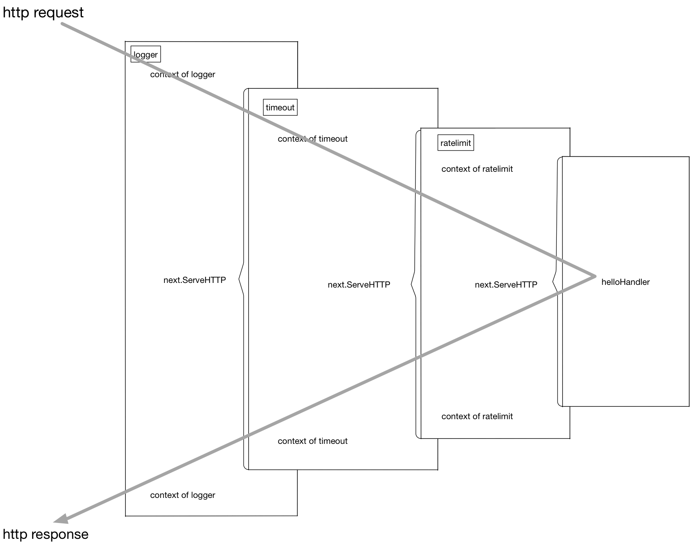
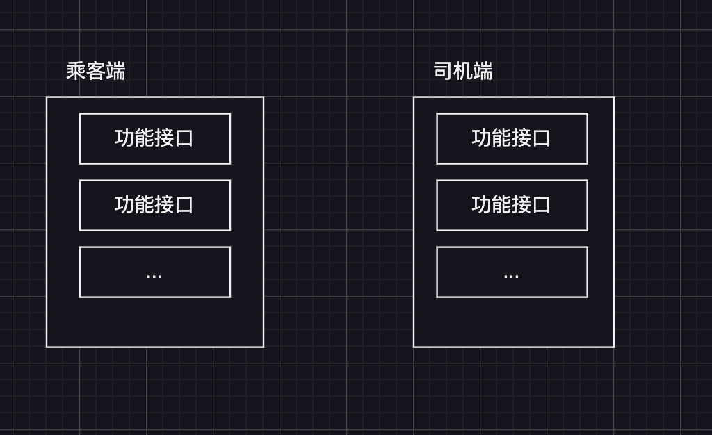
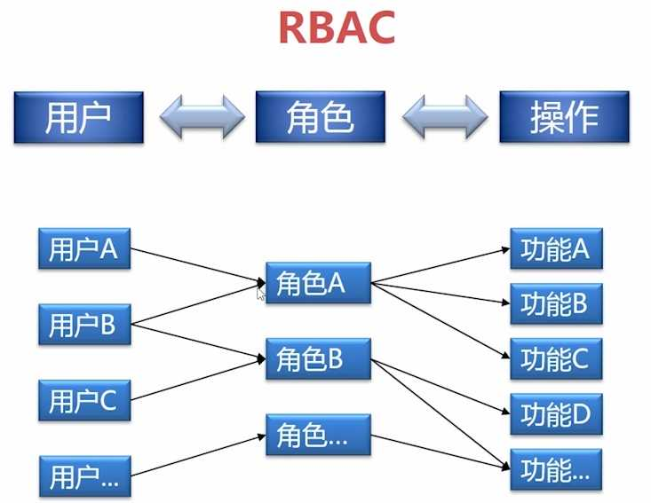

# Gin Web中间件




## 认证(Auth)

用户是谁

### 定义中间件

```go
func Auth(ctx *gin.Context) {
	// 补充坚强逻辑
	accessToken, _ := ctx.Cookie(token.COOKIE_TOKEY_KEY)
	tk, err := ioc.Controller.
		Get(token.AppName).(token.Service).
		ValidateToken(ctx.Request.Context(), token.NewValidateTokenRequest(accessToken))
	if err != nil {
		// 响应报错信息
		response.Failed(token.ErrAuthFailed.WithMessage(err.Error()), ctx)
		ctx.Abort()
	} else {
		// 鉴权成功, 请求继续往后面进行

		// 后面的handler 怎么知道 鉴权成功了, 当前是谁在访问这个接口
		// 请求的上下文:
		// 怎么把中间件请求结果，添加到请求的上下文中
		// 	// Keys is a key/value pair exclusively for the context of each request.
		// Keys map[string]any
		// Gin 采用一个map对象来维护中间传递的数据
		// context.WithValue()
		ctx.Set(token.GIN_TOKEN_KEY_NAME, tk)
		ctx.Next()
	}
}
```


### 加载中间件

注意 有先后顺序
```go
// 不需要鉴权，公开访问
appRouter.GET("/", h.QueryBlog)
appRouter.GET("/:id", h.DescribeBlog)

// 修改变更需要认证
appRouter.Use(middleware.Auth)
appRouter.POST("/", h.CreateBlog)
appRouter.PUT("/:id", h.PutUpdateBlog)
appRouter.PATCH("/:id", h.PatchUpdateBlog)
appRouter.POST("/:id/status", h.UpdateBlogStatus)
appRouter.DELETE("/:id", h.DeleteBlog)
```

### 获取中间件注入的上下文

```go
// 补充上下文中注入的 中间数据
if v, ok := ctx.Get(token.GIN_TOKEN_KEY_NAME); ok {
    req.CreateBy = v.(*token.Token).UserName
}
```

## 鉴权

你能干什么(权限), 你已经登录，但是并不是所有的业务功能你都是用
+ 作者: 文章的生成, 文章的创建接口 只允许 作者才能 使用
+ 评论审核: 审核员负责审核位置是否通过
    + 评论模块 有一个审核接口，只允许 评论审核员 使用


比如其他类型的例子:



到认证后，都到业务之前，加一层 权限坚定逻辑, 明确指定这个接口可以被那个角色访问
```go
appRouter.POST("/", Required("Author"), h.CreateBlog)
appRouter.POST("/", Required("Auditor"), h.CreateBlog)
```

### RBAC

user a: perm: []
user b: perm: []



### 定义中间件

```go
// 这是一个需要有参数的中间件: Require("auditor")
// 通过一个函数返回一个中间件: gin HandleFunc
// 这个中间件是加载在 认证中间件之后的
func RequireRole(requiredRoles ...user.Role) func(ctx *gin.Context) {
	return func(ctx *gin.Context) {
		// 判断当前用户的身份是不是匹配角色匹配
		// 补充上下文中注入的 中间数据
		if v, ok := ctx.Get(token.GIN_TOKEN_KEY_NAME); ok {
			for i := range requiredRoles {
				requiredRole := requiredRoles[i]
				if v.(*token.Token).Role == requiredRole {
					ctx.Next()
					return
				}
			}
		}

		response.Failed(token.ErrPermissionDeny, ctx)
		ctx.Abort()
	}
}
```

### 加载中间件

```go
// 修改变更需要认证
appRouter.Use(middleware.Auth)
appRouter.POST("/", middleware.RequireRole(user.ROLE_AUTHOR), h.CreateBlog)
appRouter.PUT("/:id", middleware.RequireRole(user.ROLE_AUTHOR), h.PutUpdateBlog)
appRouter.PATCH("/:id", middleware.RequireRole(user.ROLE_AUTHOR), h.PatchUpdateBlog)
appRouter.POST("/:id/status", middleware.RequireRole(user.ROLE_AUTHOR), h.UpdateBlogStatus)
appRouter.DELETE("/:id", middleware.RequireRole(user.ROLE_AUTHOR), h.DeleteBlog)
```