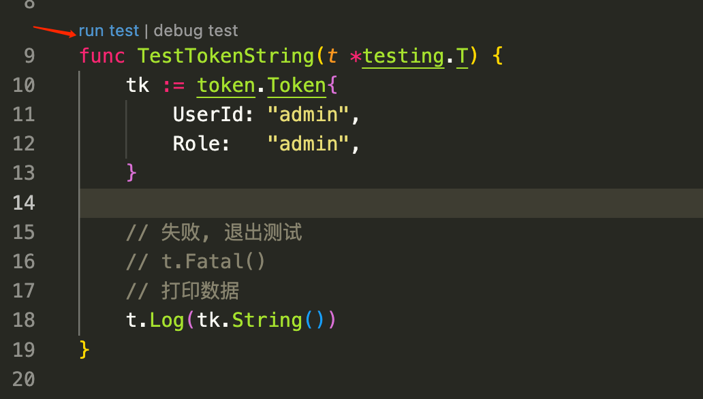
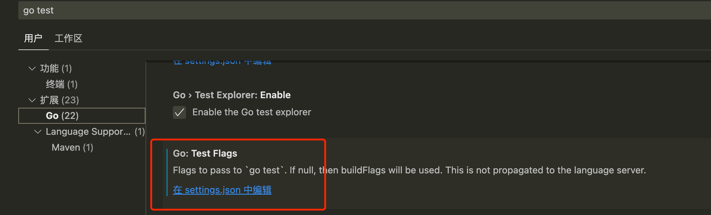
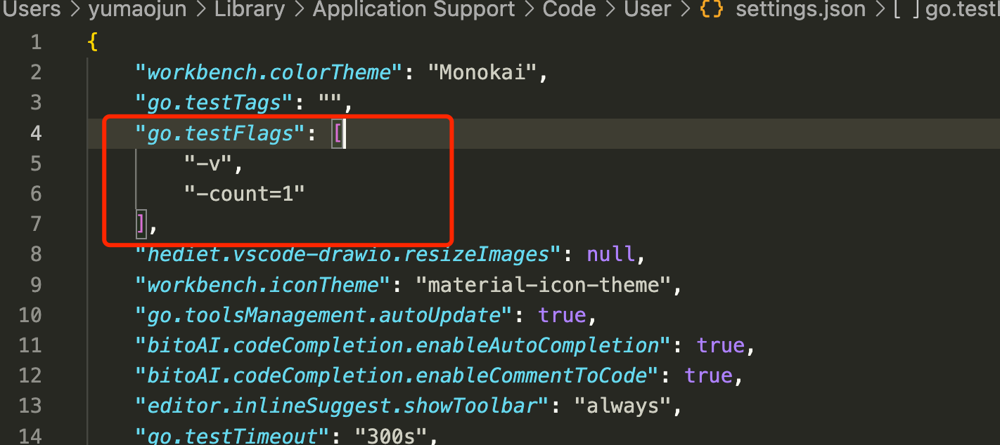
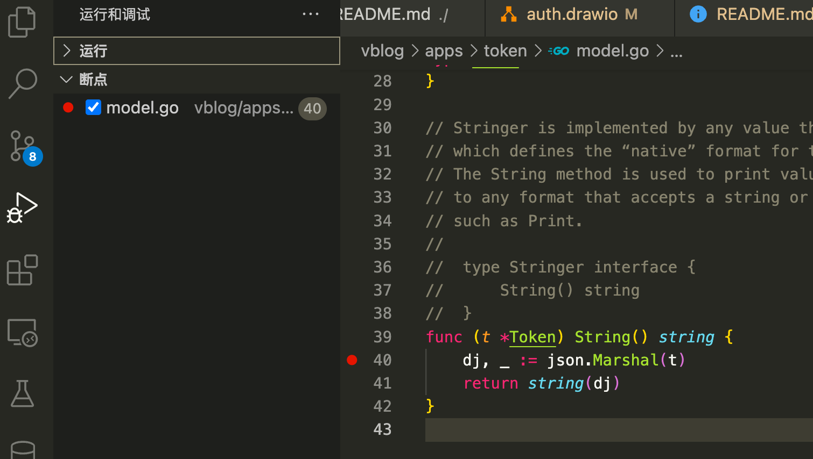
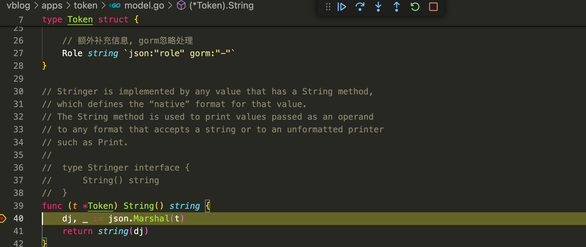
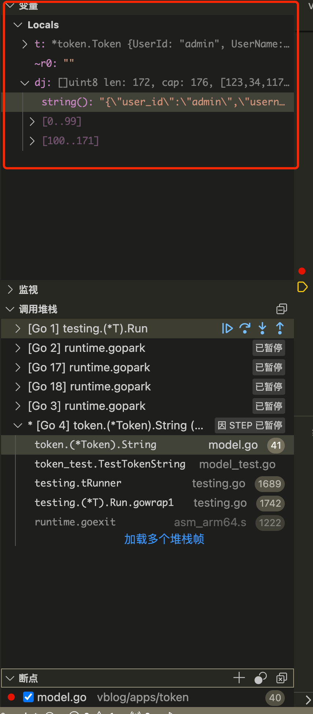
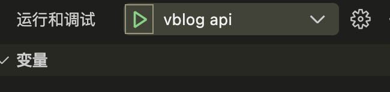
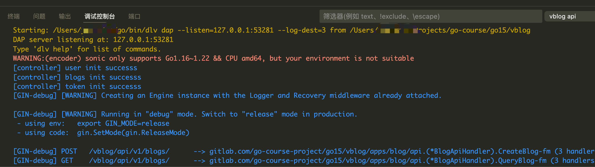

# 初始化单测环境

+ 配置
+ 加载ioc


## 单测Debug

# 令牌管理模块

## 关于单元测试

1. 被测试文件:  文件名_test.go
2. 被测试包:  包名_test   token ---> token_teset
3. 被测试函数:  
    + 测试函数名称: Test被测试函数的名称
    + 测试函数签名: (t *test.Testing)


### VsCode 单元测试配置



vscode 调用了一个命令:
```sh
Running tool: /usr/local/go/bin/go test -timeout 300s -run ^TestTokenString$ gitlab.com/go-course-project/go15/vblog/apps/token -v -count=1
```

编辑vscode编程 go test参数
+ -v: 打印Debug时候的日志
+ -count=1: 至少执行一次, 如果你的单元测试没有修改, 单元测试的结果会被缓存





### Test

```sh
Running tool: /usr/local/go/bin/go test -timeout 300s -run ^TestTokenString$ gitlab.com/go-course-project/go15/vblog/apps/token -v -count=1

=== RUN   TestTokenString
    /Users/yumaojun/Projects/go-course/go15/vblog/apps/token/model_test.go:18: {"user_id":"admin","username":"","access_token":"","access_token_expired_at":0,"refresh_token":"","refresh_token_expired_at":0,"created_at":0,"updated_at":0,"role":"admin"}
--- PASS: TestTokenString (0.00s)
PASS
ok  	gitlab.com/go-course-project/go15/vblog/apps/token	0.917s
```

### Debug Test



1. 在你需要排除的地方打上断点
2. 点击单元测试的Debug Test

```sh
Starting: /Users/yumaojun/go/bin/dlv dap --listen=127.0.0.1:56901 --log-dest=3 from /Users/yumaojun/Projects/go-course/go15/vblog/apps/token
DAP server listening at: 127.0.0.1:56901
Type 'dlv help' for list of commands.
PASS
Process 81511 has exited with status 0
Detaching
```

+ Continue: 到下一个段点
+ Step Over: 下一步
+ Step In: 单步调试
+ Step Out: 跳出单步调试


如何Debug, 观察程序运行的的变量



## 进程 Debug

1. vscode debug配置
```go
{
    // 使用 IntelliSense 了解相关属性。 
    // 悬停以查看现有属性的描述。
    // 欲了解更多信息，请访问: https://go.microsoft.com/fwlink/?linkid=830387
    "version": "0.2.0",
    "configurations": [
        {
            "name": "vblog api",
            "type": "go",
            "request": "launch",
            "mode": "auto",
            "program": "${workspaceFolder}/main.go",
            "cwd": "${workspaceFolder}",
            "args": ["start","-c","etc/application.yaml"]
        }
    ]
}
```

2. 添加断点


3. 程序debug启动: 


在调整控制台看Debug程序启动日志


4. 请求服务, 如果请求逻辑经过 debug 断点 就暂停，愉快Debug了